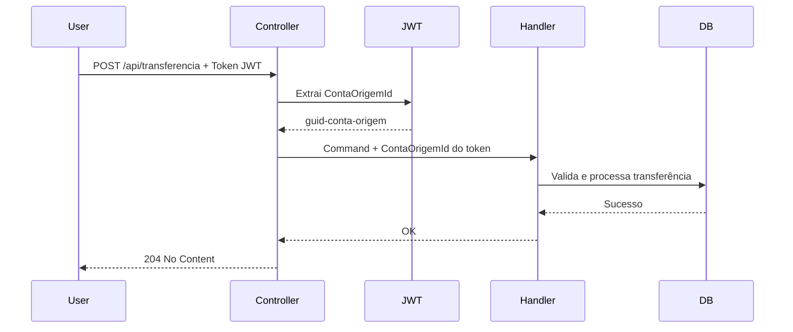

# 🔒 Refatoração de Segurança - Remoção de Parâmetros de Conta dos Endpoints

## 📋 Resumo das Mudanças

Esta refatoração **remove parâmetros desnecessários** dos endpoints, **extraindo informações da conta diretamente do token JWT**. Isso melhora **segurança**, **UX** e **consistência**.

---

## ✅ Motivação

### **Problema Anterior:**
```json
POST /api/transferencia
{
  "contaOrigemId": "user-controlled", // ⚠️ RISCO DE SEGURANÇA
  "contaDestinoNumero": 54321,
  "valor": 100.00
}
```

**Riscos:**
- ❌ Usuário poderia forjar `contaOrigemId` e transferir de contas alheias
- ❌ Payload maior e mais complexo
- ❌ Duplicação de dados (já está no token)

### **Solução Atual:**
```json
POST /api/transferencia
{
  "identificacaoRequisicao": "uuid-idempotencia",
  "contaDestinoNumero": 54321,
  "valor": 100.00
}
```

**Benefícios:**
- ✅ **Segurança**: Conta origem SEMPRE vem do token (não pode ser falsificada)
- ✅ **UX**: Menos campos no request
- ✅ **Consistência**: Garante que a operação é da conta autenticada

---

## 🔧 Arquivos Modificados

### **1. Account.API - Comando de Movimentação**

**Arquivo:** `Account.API/Application/Commands/RealizarMovimentacaoCommand.cs`

**Antes:**
```csharp
public record RealizarMovimentacaoCommand(
    string IdentificacaoRequisicao,
    int? NumeroConta,  // ⚠️ No construtor (vem do request)
    decimal Valor,
    char Tipo
) : IRequest
{
    public Guid? ContaOrigemId { get; init; }
}
```

**Depois:**
```csharp
public record RealizarMovimentacaoCommand(
    string IdentificacaoRequisicao,
    decimal Valor,
    char Tipo
) : IRequest
{
    // Propriedades internas preenchidas pelo controller a partir do token
    public Guid? ContaOrigemId { get; init; }
    public int? NumeroConta { get; init; }
}
```

**Mudança:**
- `NumeroConta` **removido do construtor** (não vem mais do request)
- Agora é propriedade interna preenchida pelo controller a partir do JWT

---

### **2. Account.API - Controller de Movimentação**

**Arquivo:** `Account.API/Controllers/MovimentacaoController.cs`

**Antes:**
```csharp
public async Task<IActionResult> Post(RealizarMovimentacaoCommand command)
{
    var contaIdClaim = User.FindFirst("ContaId")?.Value;
    var numeroContaClaim = User.FindFirst("NumeroConta")?.Value;
    
    // ⚠️ Se NumeroConta não fornecido, usa do token
    var numeroContaFinal = command.NumeroConta ?? numeroContaToken;
    
    var commandWithContaId = command with 
    { 
        NumeroConta = numeroContaFinal,
        ContaOrigemId = contaOrigemId 
    };
}
```

**Depois:**
```csharp
public async Task<IActionResult> Post(RealizarMovimentacaoCommand command)
{
    var contaIdClaim = User.FindFirst("ContaId")?.Value;
    var numeroContaClaim = User.FindFirst("NumeroConta")?.Value;
    
    // ✅ SEMPRE usa do token
    var commandWithContaId = command with 
    { 
        ContaOrigemId = contaOrigemId,
        NumeroConta = numeroConta
    };
}
```

**Mudança:**
- Remove lógica condicional (`command.NumeroConta ?? token`)
- **SEMPRE** usa valores do token JWT

---

### **3. Transfer.API - AccountApiClient**

**Arquivo:** `Transfer.API/Infrastructure/Http/AccountApiClient.cs`

**Antes:**
```csharp
var payload = new
{
    identificacaoRequisicao,
    numeroConta,  // ⚠️ Enviado no payload
    valor,
    tipo
};
```

**Depois:**
```csharp
// NumeroConta não é enviado - Account.API extrai do token JWT
var payload = new
{
    identificacaoRequisicao,
    valor,
    tipo
};
```

**Mudança:**
- Remove `numeroConta` do payload HTTP
- Account.API extrai automaticamente do token

---

### **4. Transfer.API - CachedAccountApiClient**

**Arquivo:** `Transfer.API/Infrastructure/Http/CachedAccountApiClient.cs`

**Antes:**
```csharp
// Invalida cache usando numeroConta do parâmetro
if (result && numeroConta.HasValue)
{
    var cacheKey = $"saldo:conta:{numeroConta}";
    await _cache.RemoveAsync(cacheKey);
}
```

**Depois:**
```csharp
// Extrai ContaId do token JWT para invalidar cache correto
var handler = new JwtSecurityTokenHandler();
var jwtToken = handler.ReadJwtToken(token);
var contaIdClaim = jwtToken.Claims.FirstOrDefault(c => c.Type == "ContaId")?.Value;

if (!string.IsNullOrEmpty(contaIdClaim))
{
    var cacheKey = $"saldo:conta:{contaIdClaim}";
    await _cache.RemoveAsync(cacheKey);
}
```

**Mudança:**
- Invalidação de cache agora usa `ContaId` extraído do token
- Mais robusto e seguro

---

## 📊 Comparação: Antes vs Depois

### **Transfer.API - Realizar Transferência**

#### **ANTES:**
```http
POST /api/transferencia HTTP/1.1
Authorization: Bearer eyJhbGc...
Content-Type: application/json

{
  "identificacaoRequisicao": "uuid-123",
  "contaOrigemId": "guid-user-controlled",  ⚠️ INSEGURO
  "contaDestinoNumero": 54321,
  "valor": 100.00
}
```

#### **DEPOIS:**
```http
POST /api/transferencia HTTP/1.1
Authorization: Bearer eyJhbGc...
Content-Type: application/json

{
  "identificacaoRequisicao": "uuid-123",
  "contaDestinoNumero": 54321,
  "valor": 100.00
}
```

✅ **Conta origem extraída automaticamente do token!**

---

### **Account.API - Realizar Movimentação**

#### **ANTES:**
```http
POST /api/movimentacao HTTP/1.1
Authorization: Bearer eyJhbGc...
Content-Type: application/json

{
  "identificacaoRequisicao": "uuid-456",
  "numeroConta": 12345,  ⚠️ Opcional (podia ser falsificado)
  "valor": 50.00,
  "tipo": "C"
}
```

#### **DEPOIS:**
```http
POST /api/movimentacao HTTP/1.1
Authorization: Bearer eyJhbGc...
Content-Type: application/json

{
  "identificacaoRequisicao": "uuid-456",
  "valor": 50.00,
  "tipo": "C"
}
```

✅ **Número da conta extraído automaticamente do token!**

---

## 🔒 Benefícios de Segurança

| Aspecto | Antes | Depois |
|---------|-------|--------|
| **Falsificação de Conta** | ❌ Possível | ✅ Impossível |
| **Surface Attack** | ❌ Maior | ✅ Menor |
| **Validação de Autorização** | ❌ Manual | ✅ Automática |
| **Auditoria** | ❌ Difícil rastrear | ✅ Token sempre correto |

---

## 🎯 Fluxo de Autenticação/Autorização



**Pontos-chave:**
1. ✅ Controller **sempre** extrai do token
2. ✅ Handler recebe comando já com conta correta
3. ✅ Impossível falsificar conta origem

---

## 🧪 Como Testar

### **1. Transferência**

```bash
# Login
POST http://localhost:5001/api/auth/login
{
  "cpf": "12345678900",
  "senha": "senha123"
}

# Resposta
{
  "token": "eyJhbGc...",
  "numeroConta": 12345
}

# Transferência (sem contaOrigemId)
POST http://localhost:5002/api/transferencia
Authorization: Bearer eyJhbGc...
{
  "identificacaoRequisicao": "uuid-unique",
  "contaDestinoNumero": 54321,
  "valor": 100.00
}

# ✅ Conta origem = 12345 (do token)
```

### **2. Movimentação**

```bash
# Movimentação (sem numeroConta)
POST http://localhost:5001/api/movimentacao
Authorization: Bearer eyJhbGc...
{
  "identificacaoRequisicao": "uuid-unique",
  "valor": 50.00,
  "tipo": "C"
}

# ✅ Número da conta = 12345 (do token)
```

---

## ✅ Checklist de Validação

- ✅ Build com sucesso
- ✅ `NumeroConta` removido do payload de movimentação
- ✅ `ContaOrigemId` sempre extraído do token
- ✅ Cache invalidado corretamente usando token
- ✅ Documentação Swagger atualizada
- ✅ Impossível falsificar conta origem

---

## 📚 Próximos Passos (Opcional)

1. **Auditoria de Logs**
   - Logar sempre `ContaId` extraído do token
   - Facilita rastreamento de operações

2. **Rate Limiting por Conta**
   - Limitar operações por `ContaId` do token
   - Prevenir abuso

3. **Testes de Segurança**
   - Tentar enviar `contaOrigemId` falso
   - Validar que é ignorado

---

## 💡 Conclusão

Esta refatoração **eliminou vetores de ataque** e **simplificou a API**:

1. 🔒 **Segurança**: Impossível falsificar conta origem
2. 🎯 **Consistência**: Sempre usa dados do token autenticado
3. 📉 **Complexidade**: Menos parâmetros no request
4. ✅ **Conformidade**: Alinhado com melhores práticas OAuth/JWT

**Sistema mais seguro e fácil de usar!** 🎉
